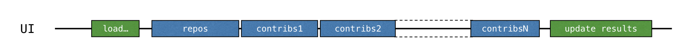
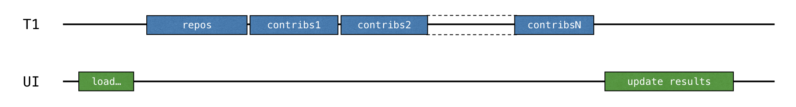
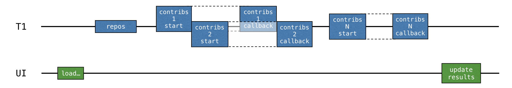
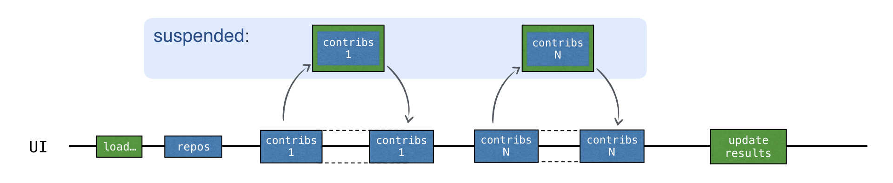
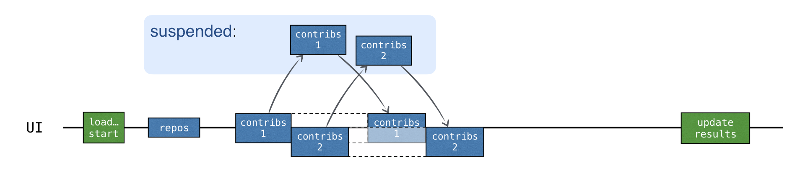
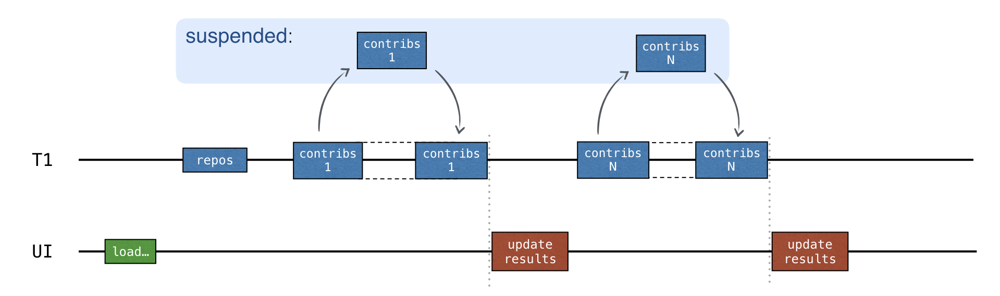
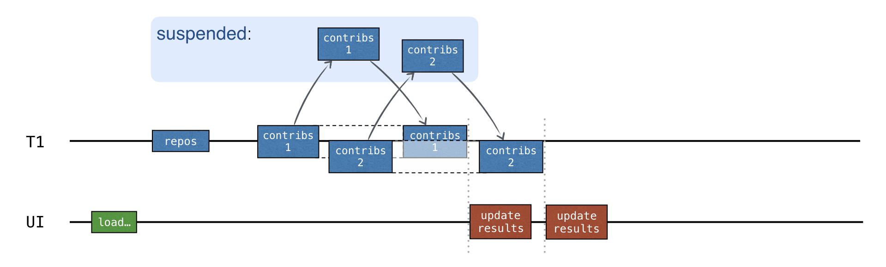
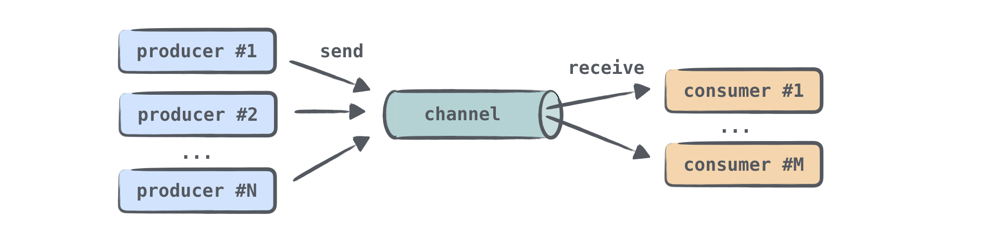

# Introduction to Coroutines and Channels Hands-On Lab

This repository is the code corresponding to the
[Introduction to Coroutines and Channels](https://play.kotlinlang.org/hands-on/Introduction%20to%20Coroutines%20and%20Channels/01_Introduction)
Hands-On Lab. 

[Tutorial](https://play.kotlinlang.org/hands-on/Introduction%20to%20Coroutines%20and%20Channels/04_Suspend)

### Tasks
-[ ] (Task1) open src/tasks/Aggregation.kt and implement List<User>.aggregate()

### 1. Blocking Request

### 2. Callbacks
The previous solution works, but blocks the thread and therefore freezes the UI. 
A traditional approach to avoiding this is th use callbacks.

2 ways to make the UI responsive:
* Move the whole computation to a separate thread T1

* Switch to Retrofit API and start using callbacks instead if blocking calls

Handling the data for each repository should be then divided into 2 parts: first loading, then processing the resulting response. 
The second "processing" part should be extracted into a callback.
The loading for each repository can then be started before the result for the previous repository is received.

### 3. Suspend Functions

* thread ~ block = coroutine ~ suspend

Coroutines are often called light-weight threads. 
That means we can run code on coroutines similar to how we run code on threads.
The operations that were blocking before can now suspend the coroutine instead.

Coroutines are computations that run on top of threads and can be suspended.
When a coroutine is suspended, the corresponding computation is paused, removed from the thread, and stored in memory.
Meanwhile, the thread is free to be occupied with other activities.

### 4. Concurrency
* *async* --> starts a new coroutine and returns a Deferred object

*Deferred* represents a concept known by other names such as *Future* / *Promise* : 
it stores a computation, but it *defers* the moment you get the final result;
it *promises* the result sometime in the future.

The main difference between *async* and *launch* 
--> *launch* is used for starting a computation that isn't expected to return a specific result.

* *launch* returns *Job*, which represents the coroutine
* *Deferred* is a generic type which extends *Job*

### 5. Structured Concurrency 
To start a new coroutine: *launch* / *async* / *runBlocking*

*runBlocking* is defined as a top-level function because it blocks the current thread.
It is intended primarily to be used in *main* functions and tests as a bridge function.

Benefits of structured concurrency:
* The scope is generally responsible for child coroutines, and their lifetime is attached to the lifetime of the scope.
* The scope can automatically cancel child coroutines if something goes wrong or if a user simply changes their mind and decides to revoke the operation.
* The scope automatically waits for completion of all the child coroutines. 
Therefore, if the scope corresponds to a coroutine, then the parent coroutine does not complete until all the coroutines launched in its scope are complete.

When using GlobalScope.async, there is no structure that binds several coroutines to a smaller scope.
The coroutines started from the global scope are all independent; 
their lifetime is limited only by the lifetime of the whole application.

### 6. Showing Progress ###
An *updateResults* callback is called after each request is completed.

We haven't used any concurrency so far --> code is sequential, so we don't need synchronization.

To send requests concurrently and update the intermediate results after getting the response for each repo --> use Channels

### 7. Channels ###
Writing code with a shared mutable state is known to be difficult and error-prone.
Sharing information by communication instead of sharing information using the common mutable state tries to simplify this.
Coroutines can communicate with each other via channels.

Channels are communication primitives that allow us to pass data between different coroutines.
One coroutine can send some information to a channel, while the other one can receive this information from it.

When needed, many coroutines can send information to the same channel, 
and many coroutines can receive information from it.

We can think of a channel as similar to a collection of elements. 
There's an important different: unlike collections, a channel can suspend send and receive operations.
This happends when the channel is empty or full

Channel Types:
* Unlimited channel -> producers can send elements to this channel, and will grow infinitely.
The send call will never be suspended. 
OutOfMemoryException if there's no more memory.
The difference with a queue appears when a consumer tries to receive from an empty channel and gets suspended until some new elements are sent to this channel.

* Buffered channel -> size is constrained by the specified number.
Producers can send elements to this channel until the size limit is reached.
Whe the channel is full, the next send call on it suspends until more free space appears.

* "Rendezvous" channel -> a channel with a buffer = creating a buffered channel with zero size.
One of the functions (send or receive) always gets suspended until the other is called.
If the send function is called and there's no suspended receive call ready to process the element, 
then send suspends.
If the receive function is called and the channel is empty, then the receive call suspends.
"rendezvous" name (a meeting at an agreed time and place) refers to the fact that send and receive should meet on time.

* Conflated channel -> a new element send to the conflated channel will overwrite the previously sent element,
so the receiver will always get only the latest element.
The send call will never suspend.
